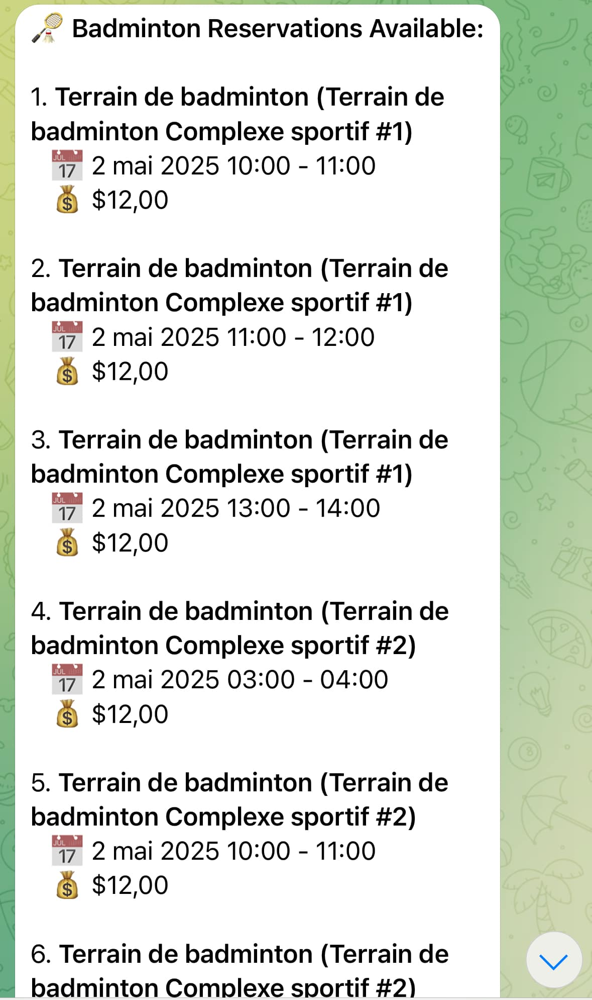

# Badminton Booker

An automated tool to get notified when a badminton court is available for booking. This is for personal use, not for business purposes.

## Project Structure

The project now follows a well-organized Python package structure:

```
badminton-booker/
│
├── badminton_booker/           # Main package directory
│   ├── booking/                # Booking related functionality
│   ├── notification/           # Notification functionality
│   ├── config/                 # Configuration handling
│   └── cli/                    # Command line interfaces
│
├── scripts/                    # Utility scripts
├── tests/                      # Test directory
├── data/                       # Data directory for output files
└── docs/                       # Documentation
```

## Prerequisites

- Python 3.9+ installed on your system
- pip (Python package manager)

## Setup Instructions

### Option 1: Using the Setup Script (Recommended)

The easiest way to set up the project is using the included setup script:

```bash
# Make the setup script executable (if needed)
chmod +x scripts/setup.sh

# Run the setup script
./scripts/setup.sh
```

This will:
1. Create a virtual environment
2. Install all required dependencies
3. Set up Playwright browser for automation
4. Create a .env file template for you to fill in

### Option 2: Manual Setup

If you prefer to set up manually:

```bash
# Create a virtual environment
python3 -m venv venv

# Activate the virtual environment
source venv/bin/activate

# Install dependencies
pip install -r requirements.txt

# Install Playwright browsers
python -m playwright install --with-deps
```

## Environment Configuration

This project uses environment variables for configuration. You can set them in a `.env` file:

```
# Telegram Bot Configuration
TELEGRAM_BOT_TOKEN=your_bot_token_here
TELEGRAM_CHAT_ID=your_chat_id_here

# Badminton Booking Configuration
NEIGHBORHOODS=Ahuntsic - Cartierville,Saint-Laurent
BOOKING_URL=https://your-booking-website-url.com
```

Copy the `.env.example` file to `.env` and update the values.

## Getting Your Telegram Chat ID

To get your Telegram chat ID, use the provided script:

```bash
chmod +x scripts/get_chat_ids.sh
./scripts/get_chat_ids.sh
```

Follow the instructions provided by the script to get your chat ID.

## Running the Application

With the virtual environment activated, run the booking script:

```bash
python main.py
```

### Command Line Options

```bash
# Run in headless mode (no browser UI)
python main.py --headless

# Run in test mode (saves results to JSON file)
python main.py --test
```

## Testing

Run the tests with:

```bash
python -m unittest discover tests
```

## Telegram Notifications

The application uses Telegram to send notifications about available courts. Make sure your Telegram bot token is correctly set in your `.env` file before running.

To test the notification system:

```bash
python -m badminton_booker.notification.telegram
```
<div align="center">
    
</div>
Sample of the telegram notification

## Automated Running with GitHub Actions

This project includes a GitHub Actions workflow that automatically runs the script on a schedule:
- Monday, Tuesday, Thursday, Friday, Saturday, and Sunday at 8:00 AM UTC

To set up GitHub Actions:
1. Push this repository to GitHub
2. Set up the required secrets in your GitHub repository
3. The workflow will run automatically on the configured schedule

See [GITHUB_ACTIONS_SETUP.md](docs/GITHUB_ACTIONS_SETUP.md) for detailed instructions on setting up the required GitHub secrets.

## Testing GitHub Actions Locally

You can test the GitHub Actions workflow locally using [act](https://github.com/nektos/act), a tool that runs your GitHub Actions locally using Docker:

### Install Act

On macOS, use Homebrew to install:

```bash
brew install act
```

Docker is also required to run the test container

### Create a Secrets File

Create a `.secrets` file in the project root to store environment variables:

```
TELEGRAM_BOT_TOKEN=your_bot_token
TELEGRAM_CHAT_ID=your_chat_id
NEIGHBORHOODS=your_neighborhoods
FIREBASE_CERT_PATH=path/to/your/firebase_service_account.json
```

### Run the Workflow

From your project root directory, run:

```bash
act -j book_badminton --secret-file .secrets
```

This executes just the `book_badminton` job from your workflow.